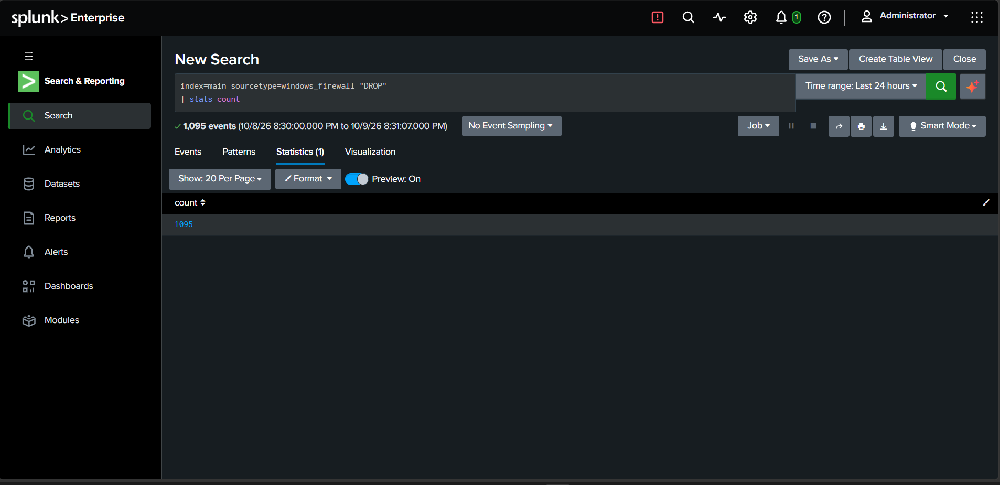
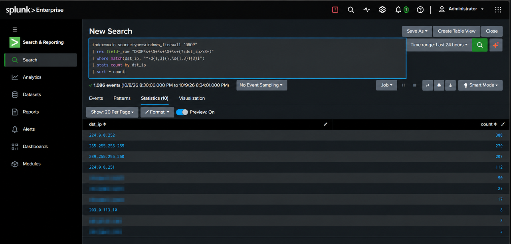
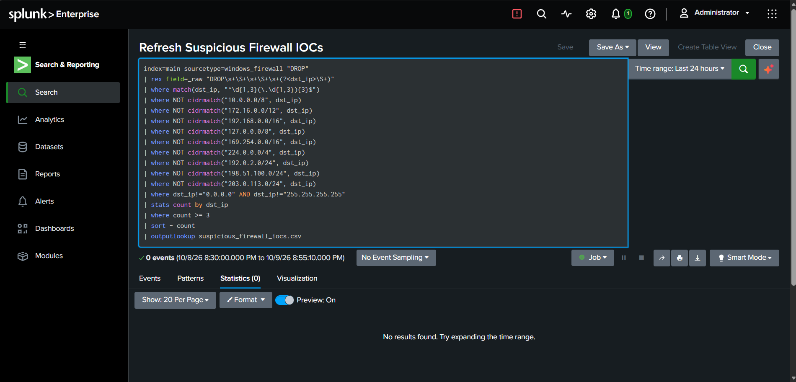
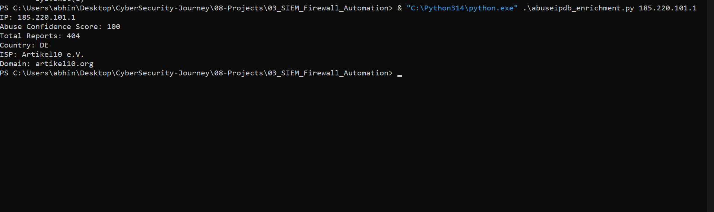
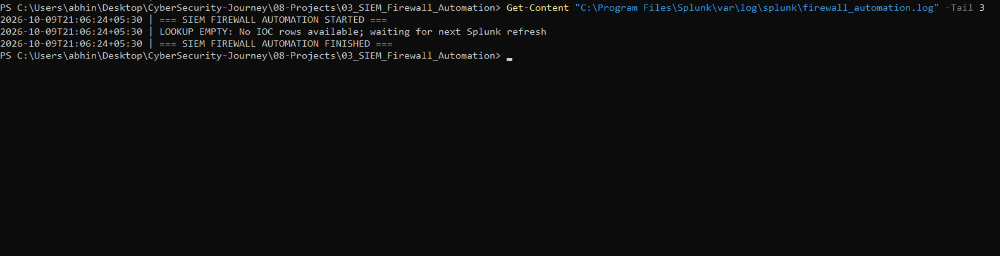

# Malicious IP/Domain Blocking via SIEM → Firewall Automation

****Project Type:**** Cybersecurity \| Blue Team \| SOC
Automation  

****Status:**** Working Prototype --- Controlled Live
Integration Test Passed  

****Date:**** October 9, 2026

## 1. Project Overview

This project demonstrates a Security Information and Event Management
(SIEM)-driven firewall automation workflow. The objective is to identify
suspicious network activity, extract potentially malicious IP addresses,
enrich them using threat intelligence, and automate firewall blocking
decisions based on reputation scores.

The project integrates Splunk Enterprise, Python, AbuseIPDB, and Windows
Defender Firewall. Splunk serves as the SIEM, Python performs IOC
processing and threat-intelligence enrichment, AbuseIPDB provides IP
reputation information, and Windows Defender Firewall provides the
blocking mechanism.

The main purpose of this project is to understand how SOC analysts can
move beyond manually investigating alerts and implement controlled,
repeatable response actions.

## 2. Objectives

-   Collect and investigate Windows Firewall logs using Splunk.

-   Create a detection search for repeated suspicious firewall activity.

-   Extract candidate IP addresses from firewall telemetry.

-   Export detection results into a CSV lookup for Python automation.

-   Enrich IP addresses using the AbuseIPDB API.

-   Make automated monitoring or blocking decisions using a reputation
    threshold.

-   Create and verify Windows Firewall blocking rules.

-   Record automation decisions and maintain a simple state file.

-   Validate the workflow through controlled integration tests.

## 3. Architecture

``` text

Lab Endpoint (Windows/Linux)

          |

          v

    Network Activity

          |

          v

Firewall Logs / Endpoint Telemetry

          |

          v

      Splunk SIEM

          |

          v

   Detection Search

          |

          v

 Extract Candidate IPs

          |

          v

       CSV Lookup

          |

          v

  Python Automation Engine

          |

          v

 AbuseIPDB Reputation Check

          |

          v

   Decision Threshold: 50

          |

          v

     Malicious IOC?

       /       \\

     YES        NO

      |          |

      v          v

Windows       Monitor

Firewall      Activity

Block Rule

      |

      v

Verify Rule and Record Decision
```

The workflow is designed to connect SIEM detection with
threat-intelligence enrichment and a firewall response. The CSV lookup
currently acts as the handoff between Splunk and the Python automation
script.

## 4. Technologies Used

| Technology | Purpose |
|---|---|
| Splunk Enterprise 10.4.3 | Log ingestion, searching, detection, and CSV export |
| Python 3.14.6 | IOC processing and automation |
| AbuseIPDB API | Public IP reputation enrichment |
| Windows Defender Firewall | Firewall rule creation and verification |
| Windows PowerShell | Firewall configuration and validation |
| Kali Linux | Lab endpoint and connectivity testing |
| CSV | Handoff between Splunk detection and Python |
| JSON | Automation decision-state storage |

## 5. Environment Setup

The project was developed using a Windows 10 host with Splunk Enterprise
and Python installed. Kali Linux was used as a separate lab virtual
machine for network connectivity and controlled testing.

Splunk Web was accessed locally at:

`http://localhost:8000`

The main Python script is located at:

`08-Projects/03_SIEM_Firewall_Automation/firewall_automation.py`

The implementation uses the host's Windows Firewall for blocking. Kali
Linux is a separate Linux endpoint and does not use Windows Defender
Firewall.

## 6. Windows Firewall Logging

Windows Firewall logging was enabled for allowed and blocked connections
using PowerShell:

``` powershell

Set-NetFirewallProfile -Profile Domain,Private,Public -LogAllowed True -LogBlocked True
```

The standard firewall log location is:

`%systemroot%\system32\LogFiles\Firewall\pfirewall.log`

The firewall log was ingested into Splunk using the `windows_firewall`
sourcetype in the `main` index.

A basic search was used to inspect dropped connections:

``` spl

index=main sourcetype=windows_firewall "DROP"
```

This search returned 653 events during testing. These events confirmed
that Splunk could search the ingested firewall telemetry.

A dropped connection is not automatically evidence of a malicious
source. Firewall drops can occur for ordinary reasons, so additional
filtering and investigation are required before treating an IP as a
potential threat.

## 7. Splunk Detection Search

The detection search identifies candidate destination IP addresses from
firewall `DROP` events, filters out private, loopback, link-local,
multicast, and documentation-only IPv4 ranges, and counts repeated
observations.

The current search uses a minimum count of three events to select
candidate IP addresses.

``` spl

index=main sourcetype=windows_firewall "DROP"

| rex field=_raw "DROP\s+\S+\s+\S+\s+(?<dst_ip>\S+)"

| where match(dst_ip, "^\d{1,3}(\.\d{1,3}){3}$")

| where NOT cidrmatch("10.0.0.0/8", dst_ip)

| where NOT cidrmatch("172.16.0.0/12", dst_ip)

| where NOT cidrmatch("192.168.0.0/16", dst_ip)

| where NOT cidrmatch("127.0.0.0/8", dst_ip)

| where NOT cidrmatch("169.254.0.0/16", dst_ip)

| where NOT cidrmatch("224.0.0.0/4", dst_ip)

| where NOT cidrmatch("192.0.2.0/24", dst_ip)

| where NOT cidrmatch("198.51.100.0/24", dst_ip)

| where NOT cidrmatch("203.0.113.0/24", dst_ip)

| where dst_ip!="0.0.0.0" AND dst_ip!="255.255.255.255"

| stats count by dst_ip

| where count >= 3

| sort - count

| outputlookup suspicious_firewall_iocs.csv
```

### Detection Notes

The search is designed to identify candidate IOCs, not to conclusively
classify IP addresses as malicious.

The exclusions help prevent private addresses and reserved documentation
ranges from being submitted for public threat-intelligence checks. The
event-count threshold reduces the number of one-off observations
selected for enrichment.

The search was executed successfully. However, during the final
validation, no IP addresses met all the search conditions. Therefore,
the resulting lookup contained no eligible IOC rows.

An empty lookup is a valid result when no events satisfy the detection
criteria. The filters were not weakened simply to force the search to
produce results.

## 8. CSV Handoff and Scheduled Refresh

The saved search named `Refresh Suspicious Firewall IOCs` was configured
to run every minute.

The output lookup is:

`C:\Program Files\Splunk\etc\apps\search\lookups\suspicious_firewall_iocs.csv`

The Python automation reads candidate IP addresses from this CSV file.

The automation safely handles an empty or zero-byte lookup. Instead of
attempting to process nonexistent records, it records an empty-lookup
message and waits for the next refresh.

This design allows the SIEM detection stage and the Python response
stage to operate independently.

## 9. Python Automation Engine

The main automation script is:

`firewall_automation.py`

The script performs the following operations:

1\. Reads candidate IP addresses from the Splunk-generated CSV file.

2\. Validates IP addresses before processing them.

3\. Rejects addresses that do not satisfy the script's public-IP
validation requirements.

4\. Queries AbuseIPDB for reputation information.

5\. Compares the returned abuse-confidence score against the configured
threshold of 50.

6\. Selects a monitoring or blocking decision.

7\. Calls the Windows Firewall blocking function when the decision and
validation conditions permit.

8\. Verifies whether the firewall rule was created successfully.

9\. Saves the processing decision in a JSON state file.

The script also handles the absence of candidate records without
treating an empty lookup as a successful malicious-IP detection.

### Reputation Threshold

The configured threshold is 50.

-   ****Score below 50:**** The IP is not selected for automatic
    blocking by this threshold.

-   ****Score of 50 or above:**** The IP becomes a blocking
    candidate, subject to validation and successful firewall-rule
    processing.

A reputation score is an input to the decision, not absolute proof that
an IP is malicious. In a production environment, automated blocking
should also consider false positives, business requirements, allowlists,
logging, and approval policies.

### Firewall Rule Naming

The automation uses the following naming convention:

`SIEM-AutoBlock-{ip}`

The script checks whether the rule can be created and verifies its
resulting configuration. A successful reputation lookup alone does not
establish that the firewall rule was created.

## 10. Automation Logging and State

The automation log is stored at:

`C:\Program Files\Splunk\var\log\splunk\firewall_automation.log`

The JSON state file is stored at:

`C:\Program Files\Splunk\var\log\splunk\firewall_automation_state.json`

These files provide a record of processing activity and decisions. They
help distinguish between an empty lookup, an IP selected for monitoring,
a blocking candidate, and a recorded successful blocking action.

The script is also configured to run through Windows Task Scheduler
under the task name:

`SIEM Firewall Automation`

The task uses the system's Python installation and is scheduled to run
every minute.

The task's return code is useful for checking process execution, but it
does not independently prove that every IOC was enriched or blocked. The
logs, state file, and actual firewall configuration must also be
checked.

## 11. Validation and Testing

Testing was carried out in stages to validate log ingestion, detection,
threat-intelligence enrichment, decision-making, and firewall-rule
handling.

### Test A --- Firewall Log Ingestion

****Result: Passed****

Firewall events were ingested into Splunk and could be searched using
the `windows_firewall` sourcetype. The search for dropped connections
returned 653 events during testing.

### Test B --- Detection Search

****Result: Executed successfully; no eligible IOCs found****

The detection search ran successfully, but no IP addresses satisfied the
complete set of filtering and event-count conditions during final
validation.

The absence of results was retained as a valid outcome rather than
changing the filters to force a match.

### Test C --- CSV Lookup Refresh

****Result: Passed****

The scheduled saved search refreshed the lookup file. The refresh
timestamp updated, and the lookup remained empty because the detection
search returned no eligible IP addresses.

The Python script handled the empty lookup safely.

### Test D --- Low-Reputation Test Case

****Result: Passed****

The public IP `8.8.8.8` was checked against AbuseIPDB. The returned
abuse-confidence score was 0 during testing.

The script selected the monitoring path and recorded the decision in the
JSON state file.

This test validated the low-score decision path; it did not test
blocking that IP.

### Test E --- Controlled High-Score Decision Test

****Result: Passed****

A controlled test simulated a high AbuseIPDB score of 85 and a
successful firewall-blocking function response.

The automation recorded the expected blocking decision in its state
file.

This test validated decision handling and state recording. Because the
score and firewall-function response were mocked, it did not
independently prove live threat-intelligence enrichment or actual
firewall blocking.

### Test F --- Windows Firewall Rule Mechanics

****Result: Passed****

A temporary outbound Windows Firewall blocking rule was created for the
Kali lab address:

`10.207.67.204`

The rule's existence, enabled state, blocking action, and remote-address
configuration were verified. The temporary rule was then removed.

This test demonstrated that the Windows host could create, inspect, and
remove a firewall rule for the lab endpoint. The private address was
used only for this controlled firewall-mechanics test, not as a public
IOC.

### Test G --- Live AbuseIPDB Reputation Check

****Result: Passed****

The public IP `185.220.101.1` was checked against AbuseIPDB during
testing and returned an abuse-confidence score of 100.

Because the configured threshold is 50, the result met the script's
blocking-candidate threshold.

The public IOC was not blocked during this standalone reputation check.

### Test H --- Controlled Live Integration Test

****Result: Passed, with a documented scope limitation****

A controlled integration test used the production `main()` orchestration
with live AbuseIPDB enrichment for `185.220.101.1`.

The live reputation score met the configured threshold. For safety, the
firewall action was redirected in memory to the Kali lab address,
`10.207.67.204`. The production script file was not modified for this
test.

The resulting Windows Firewall rule was created and verified. The
production decision state recorded the public IOC's decision as
`blocked`, and the temporary firewall rule was removed during cleanup.

The test output confirmed:

``` text

Main return code: 0

Saved production decision: blocked

Real firewall rule: PRODUCTION_RULE_VERIFIED

CONTROLLED LIVE INTEGRATION TEST: PASS

Cleanup: RULE_REMOVED
```

This validates live reputation enrichment, production orchestration,
decision recording, and real Windows Firewall rule creation through the
controlled lab redirection.

****It does not prove that the unmodified production workflow
blocked `185.220.101.1` itself.**** The firewall action targeted the
Kali lab IP instead. Direct public-IOC blocking through the unmodified
production path remains untested.

## 12. Project Evidence

The screenshots below document the main components of the prototype.
They are stored in the `Screenshots/` directory and are displayed
directly in this README when the image files are committed to the
repository.

### 12.1 Splunk Firewall Log Investigation

The Splunk search shows Windows Firewall `DROP` events collected in the
`main` index. This demonstrates that firewall telemetry was available
for investigation through Splunk Enterprise.



### 12.2 Destination IP Extraction

This screenshot shows the SPL preview query used to extract destination
IP addresses from dropped firewall events and count their occurrences.
It is a preview query, not the full production filter.



### 12.3 Production Detection Rule

The production search applies private and reserved IP exclusions, counts
repeated observations, and exports eligible candidates to a CSV lookup
for Python processing. During final validation, the search returned zero
eligible IPs; this is documented as observed rather than hidden.



### 12.4 AbuseIPDB Threat Intelligence Enrichment

The Python enrichment script queried AbuseIPDB for `185.220.101.1`.
During this test, the API returned an abuse confidence score of 100 and
404 reports. Reputation data can change over time.



### 12.5 Automation Runtime Logs

The automation log shows execution start and completion and records how
the script handles an empty IOC lookup. This demonstrates safe handling
of an empty input; it is not evidence of a firewall block.



**Evidence scope:** These screenshots document individual components.
The controlled live integration test and its limitations are described
in the validation section.

## 13. Current Project Status

The project has working components for firewall-log ingestion, Splunk
detection, CSV handoff, Python IOC processing, live AbuseIPDB
enrichment, threshold-based decisions, and Windows Firewall rule
creation and verification.

The controlled live integration test passed. The implementation remains
a prototype because the final direct public-IOC blocking path has not
been validated end to end.

The detection search also returned no eligible IOCs during the final
validation, so the normal scheduled workflow has not yet demonstrated an
automatically discovered candidate travelling from live firewall
telemetry through the complete blocking pipeline.

## 14. Limitations and Future Improvements

The following limitations remain:

-   The final detection search produced no eligible candidate IP
    addresses during validation.

-   The controlled integration test redirected the firewall action to
    the Kali lab IP. Direct blocking of the same public IOC used for
    live enrichment has not been tested.

-   The current handoff relies on a CSV file instead of a direct Splunk
    alert payload or REST API integration.

-   Repeated firewall drops are only a heuristic for selecting
    candidates and do not establish malicious intent.

-   Reputation scores can be incorrect, incomplete, or change over time.

-   The prototype requires further testing for error handling, API
    failures, duplicate rules, recovery, and operational logging.

-   Automated blocking in a real environment would require appropriate
    safeguards, allowlists, approvals, and rollback procedures.

Potential future improvements include:

-   Validate direct public-IOC blocking in an isolated, authorized
    Windows test environment.

-   Generate controlled test telemetry that exercises the detection
    criteria without weakening the production filters.

-   Add alert-level audit records and richer error reporting.

-   Implement an allowlist and duplicate-rule handling.

-   Add rollback and recovery procedures.

-   Evaluate a more direct integration between Splunk alerting and
    Python automation.

-   Extend the workflow to domain-based indicators where supported by an
    appropriate DNS or network-control mechanism.

## 15. Project Structure

``` text

03_SIEM_Firewall_Automation/

├── firewall_automation.py

├── README.md

└── Supporting test scripts and configuration
```

Splunk's saved-search configuration, lookup CSV, automation log, and
state file are maintained in their respective runtime locations rather
than being embedded in this project directory.

## 16. Key Learning Outcomes

Through this project, I practised:

-   Searching and investigating Windows Firewall telemetry in Splunk.

-   Writing SPL searches that extract and filter candidate IP addresses.

-   Using a CSV lookup to hand detection results to an external
    automation script.

-   Validating IP addresses with Python.

-   Integrating live threat-intelligence enrichment using AbuseIPDB.

-   Applying reputation thresholds to make automated decisions.

-   Creating and verifying Windows Firewall rules using Python and
    PowerShell.

-   Recording automation decisions in a JSON state file.

-   Separating mocked tests from tests that use live enrichment and
    actual firewall configuration.

-   Documenting test scope and limitations accurately.

## 17. Conclusion

This project demonstrates a practical prototype of SIEM-assisted threat
response. It connects firewall telemetry, Splunk detection, Python
automation, external IP reputation enrichment, and Windows Firewall rule
handling.

The controlled live integration test successfully demonstrated live
AbuseIPDB enrichment and actual firewall-rule creation through a
deliberate lab redirection. Direct blocking of the enriched public IOC
through the unmodified production workflow remains a future validation
step.

The project provides a foundation for further development toward a more
robust and auditable automated response workflow for SOC operations.
